# Book Library - Система за управление на библиотека

Този проект представлява завършена и пълноценна **Система за управление на книги и читатели в библиотека**. Изградена е чрез монолитна архитектура със **Spring Boot** и предоставя **REST API** слой в комбинация с потребителски интерфейс (HTML/CSS/JS), обслужван директно от статични ресурси.

Приложението обслужва два основни типа потребители:
*   **ADMIN:** Могат да добавят, редактират и изтриват книги, автори и категории, както и да управляват всички наеми.
*   **USER:** Могат да се регистрират, да разглеждат наличности, да заемат книги, да виждат историята си на заемания и да редактират личния си профил.

---

## Основни функционалности

### Управление на Книги, Автори, Категории
*   **CRUD за Книги:** Създаване на нови книги, редактиране на информация (заглавие, описание, ISBN), изтриване и преглед.
*   **Управление на Автори:** Добавяне и редактиране на автори с биография. Множество книги могат да бъдат свързани с един автор.
*   **Категоризация:** Организиране на книгите по жанрове/категории чрез Many-To-Many връзка. Всяка книга може да принадлежи към няколко категории.

### Потребители и Сигурност
*   **Регистрация и Вход:** Реализиран Authentication контролер за регистрация на нови читатели и вход. 
*   **Хеширане на пароли:** Паролите на потребителите се криптират по сигурен начин преди запис в базата.
*   **Гъвкави профили:** Всяка потребителска регистрация е обвързана с детайлен потребителски профил.

### Управление на Наеми и Глоби
*   **Заемане и връщане:** Регистрираните читатели могат да наемат книги, като системата записва автоматично датата на заемане и крайния срок (Due Date). Когато книгата се върне, се записва реалната дата на връщане.
*   **Система за глоби (Fines):** Ако потребител върне книга след изтичане на крайния срок, системата автоматично начислява финансова санкция. Глобата се изчислява динамично на дневна база (**1.00 EUR за всеки просрочен ден**). Докато книгата не е върната, натрупващата се глоба се показва с червен етикет **LATE** в профила на читателя. След връщане, финалната сума се записва трайно в историята.
*   **Административен контрол върху глобите:** Системата предоставя пълен достъп на **Администраторите (ADMIN)** да управляват и следят глобите. Чрез админ панела (`/users`), те могат да разгледат детайлно профила на всеки читател. Там виждат всички активни наеми на потребителя, текущите натрупани закъснения (в реално време) и историята на всички върнати книги и заплатени санкции. Също така, на страницата за детайли на дадена книга, админите виждат списък с всички нейни наематели във времето и техните финансови задължения.
*   **Проверка за наличност:** Книгите имат boolean статус `available`, който предпазва от наемане на вече заета книга.
*   **История:** Всеки потребител има достъп до пълната история на личните си наеми, закъсненията и заплатените глоби.

---

## Технологичен стек и Архитектура

Проектът е изграден, следвайки добрите практики за слоеста MVC архитектура в Spring:
*   **Controllers:** `RestController` класове, приемащи HTTP заявки и връщащи JSON отговори.
*   **Services:** Класове, съдържащи бизнес логиката (`BookService`, `RentalService` и др.).
*   **Repositories:** `Spring Data JPA` интерфейси за връзка с базата данни (`JpaRepository`).
*   **Entities / Models:** JPA/Hibernate модели, мапнати към таблиците в базата.
*   **База данни:** MySQL, като таблиците се генерират автоматично чрез Hibernate спрямо ентити класовете.
*   **Фронтенд:** HTML, CSS, JavaScript. Асинхронно извикване на REST API чрез `fetch()` метод.

---

## Дизайн на базата данни и Релации (E/R)

Архитектурата на базата данни демонстрира използването на всички видове релации в `Hibernate/JPA`:

*   **OneToOne:** 
    *   Релация между `User` и `UserProfile`. Един акаунт има точно един профил, в който се съхраняват допълнителни данни.
*   **OneToMany:** 
    *   `Author` към `Book` - Един писател е написал много книги.
    *   `User` към `Rental` - Един потребител е направил множество наемания на книги.
*   **ManyToMany:** 
    *   `Book` към `Category` - Една книга може да принадлежи към множество категории едновременно, а една категория съдържа множество книги.
    *   `User` към `Role` - Система за роли; даден потребител може да едновременно ADMIN и USER.

> **E/R Диаграма:**
> 
> 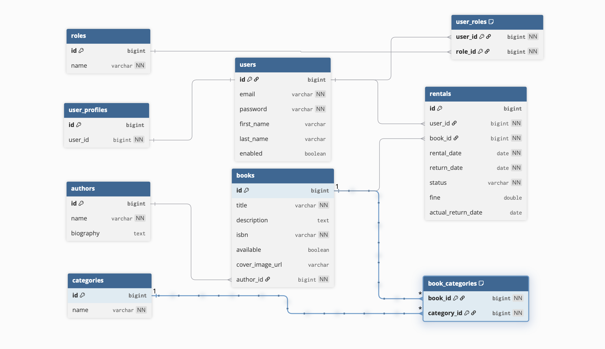

---

## Списък на основните API Endpoints (REST)

**Книги** 
- `GET` `/api/books` - Взимане на списък с всички книги
- `GET` `/api/books/{id}` - Взимане на детайли за конкретна книга
- `POST` `/api/books` - Създаване на нова книга
- `PUT` `/api/books/{id}` - Редакция на съществуваща книга
- `DELETE` `/api/books/{id}` - Изтриване на книга
**Автори** 
- `GET` `/api/authors` - Взимане на всички автори
- `GET` `/api/books/author/{authorId}` - Взимане на всички книги от конкретен автор
**Наеми** 
- `POST` `/api/rentals/rent` - Заемане (наемане) на книга
- `POST` `/api/rentals/return/{rentalId}` - Връщане на заета книга

---

## UI Screenshots

### Home
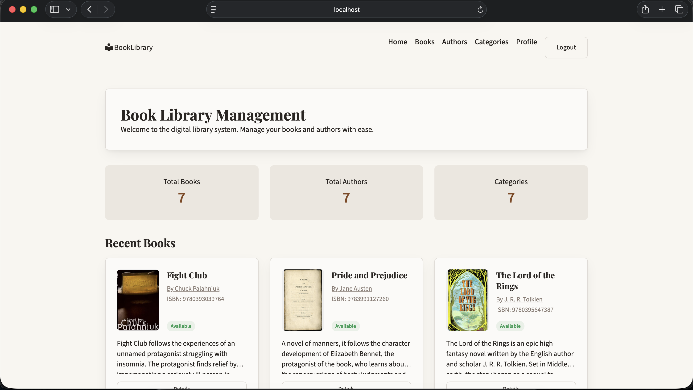

### Книги и Детайли
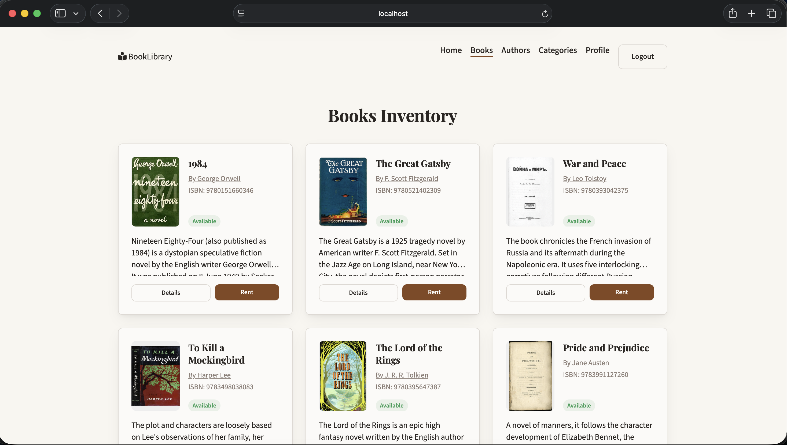
<br>
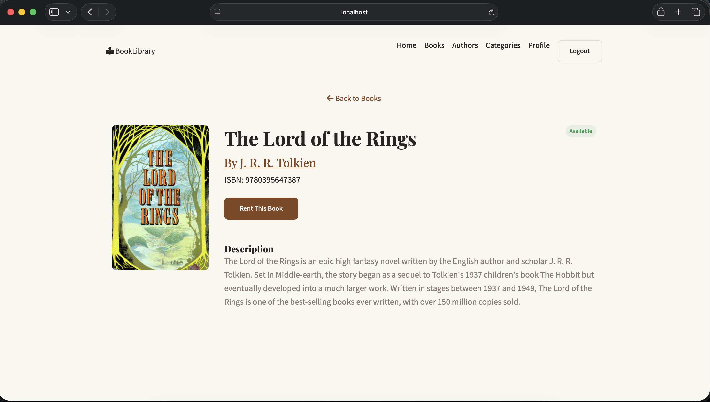

### Автори и Категории
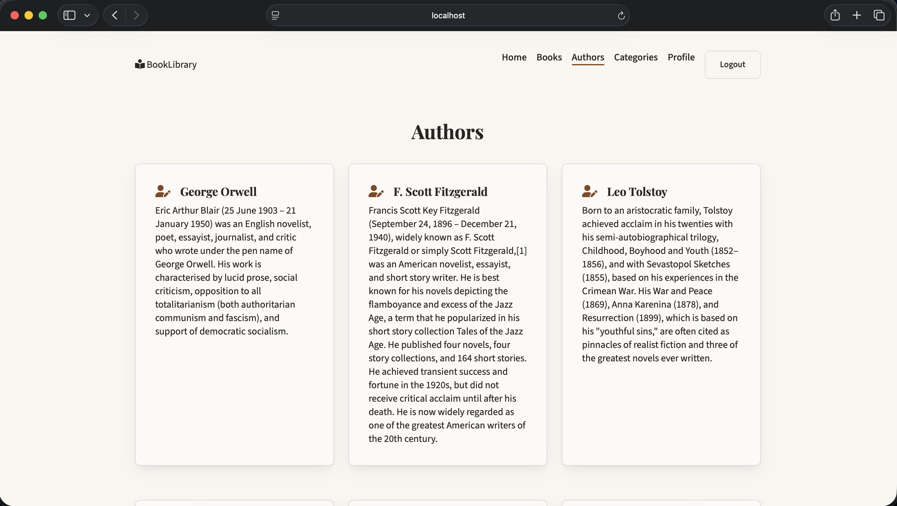
<br>
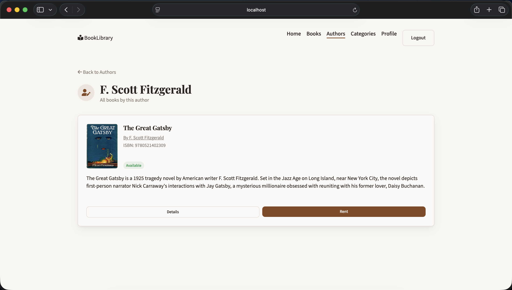
<br>
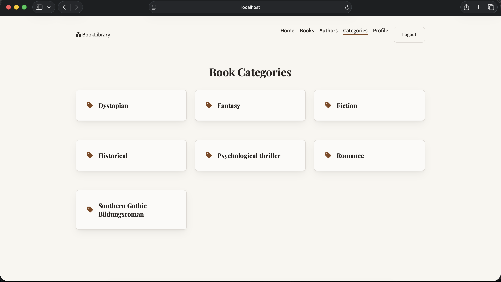
<br>
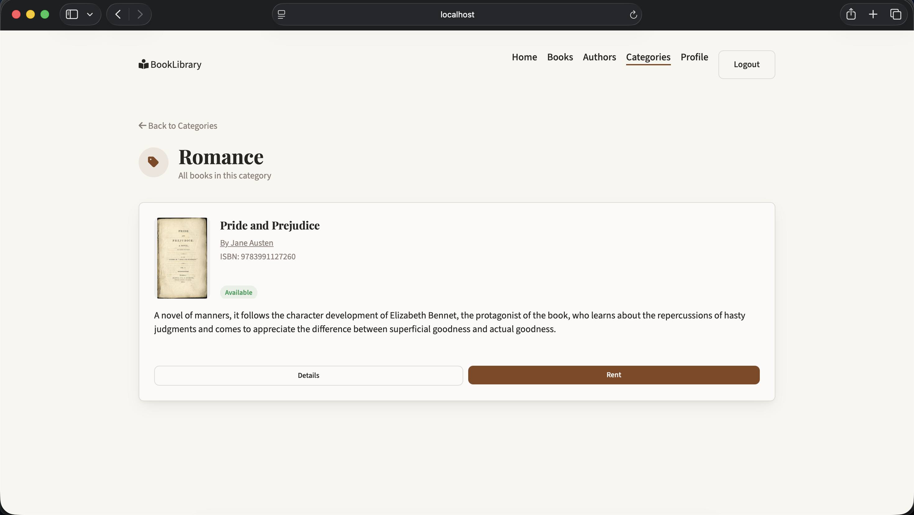

### Вход, Регистрация и Потребителски Профил
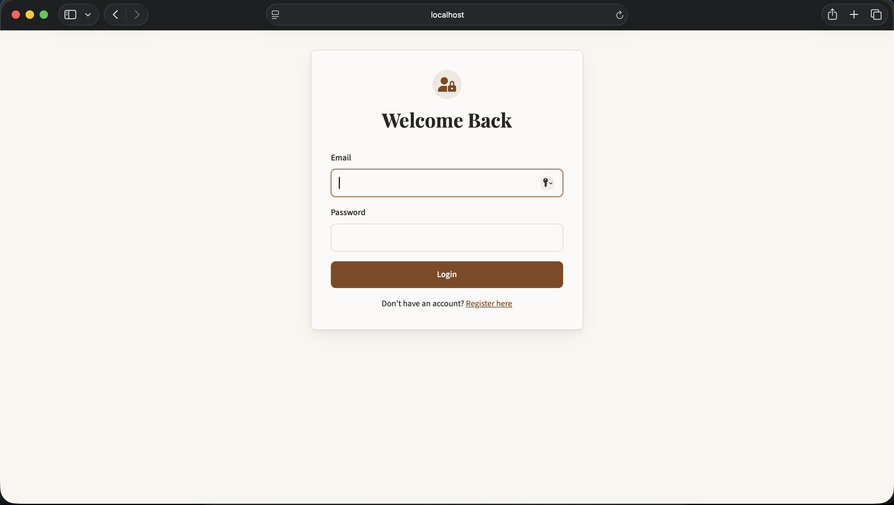
<br>
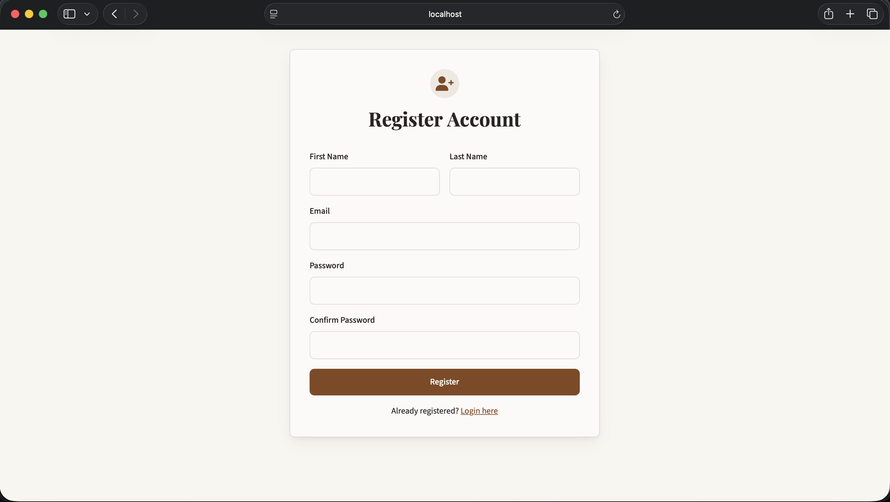
<br>
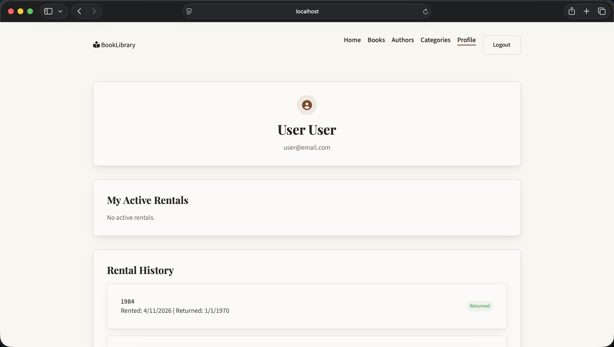

---

## Инструкции за стартиране

1. **База данни:** Създайте база данни в MySQL с име `book_library`.
2. **Конфигурация:** Уверете се, че потребителското име и парола в `src/main/resources/application.properties` (например `spring.datasource.username` и `password`) съвпадат с вашите локални такива за MySQL.
3. **Стартиране на сървъра:** Отворете терминал в главната директория и стартирайте приложението:
    ```bash
    ./gradlew bootRun
    ```
4. **Достъп през браузър:** Отворете браузър и въведете следния URL: 
   `http://localhost:8081`